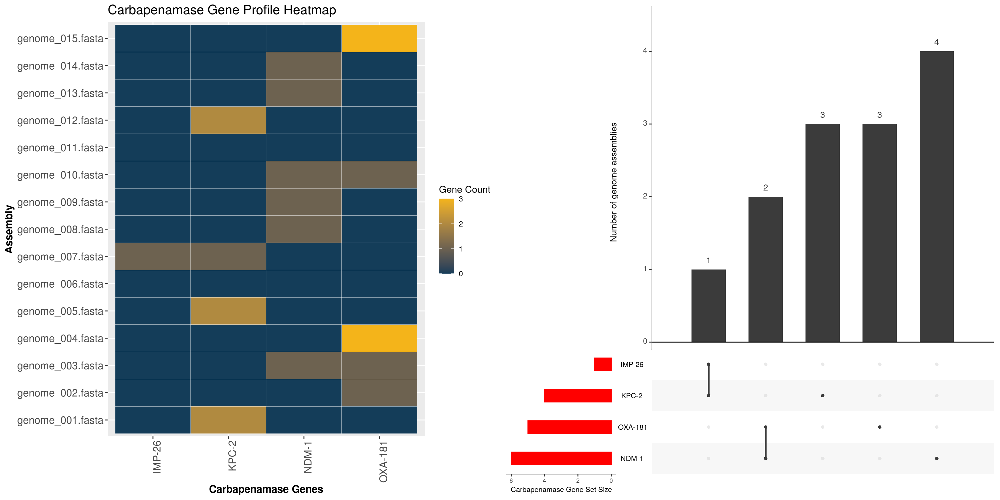
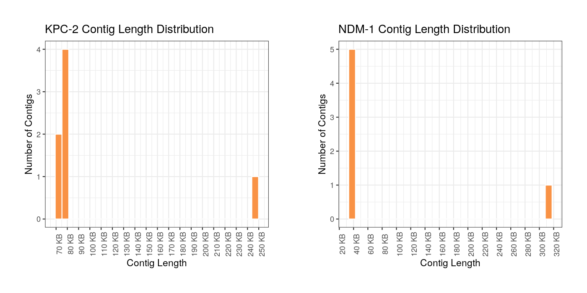
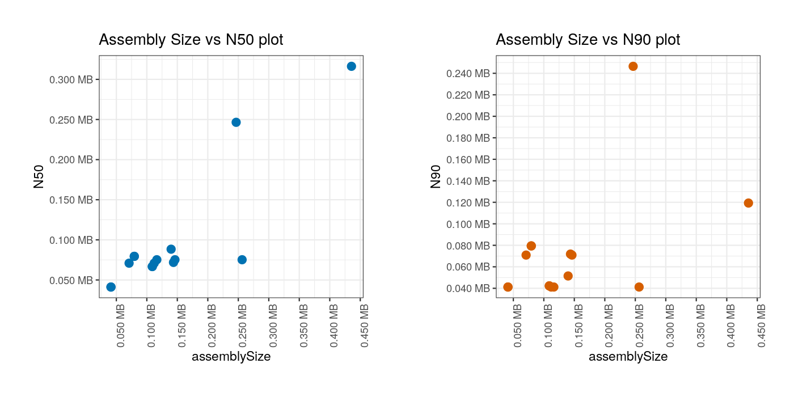

# Summary

“Carbapenems” are a specific subset of antibiotics considered to possess a higher spectrum of antimicrobial activity [@papp2011carbapenems] against Gram-positive and Gram-negative bacteria. Even so, there are pathogens which are resistant to carbapenems due to the presence of carbapenemase genes (CP genes) which have the ability to hydrolyze carbapenems. 

Studies show that those cases infected by carbapenem-resistant pathogens have a higher morbidity and mortality rate compared with those who are infected by non-carbapenem-resistant pathogens [@van2013carbapenem; @cai2017prevalence]. Therefore, early discerning of the CP genes and their resistance mechanisms are considered crucial to aid in infection control as well as lessen the likelihood of mortality, duration of hospitalization stay, and related medical costs [@van2013carbapenem; @nordmann2019epidemiology]. Further, it is understood that the cocarriage of genes encoding different classes of carbapenemases could confer higher resistance to carbapenem antibiotics, which may promote further spread of the disease [@wang2019cocarriage].

The detection of the resistance genes from various bacterial strains using techniques such as polymerase chain reaction (PCR) and microarrays in real-time are very time consuming and costly. With the advancement in whole-genome sequencing (WGS) technologies the costs are more accessible and WGS provides an alternative method for detection of resistance genes, given that the relevant analysis tools are available.

To this end, several freely available bioinformatics tools such as ``ABRicate`` (https://github.com/tseemann/abricate), ``AMRPlusPlus`` [@doster2020megares], ``ARG-ANNOT`` [@gupta2014arg], ``ARIBA`` [@hunt2017ariba], ``Comprehensive Antibiotic Resistance Database – Resistance Gene Identifier`` (CARD-RGI) [@alcock2020card], ``NCBI AMRFinderPlus`` (https://ncbi.nlm.nih.gov/pathogens/antimicrobial-resistance/AMRFinder/), ``KmerResistance`` [@clausen2016benchmarking; @clausen2018rapid], ``PointFinder`` [@zankari2017pointfinder], ``Resfinder`` [@bortolaia2020resfinder], ``sraX`` [@panunzi2020srax] and ``SRST2`` [@inouye2014srst2] assist in finding of the antimicrobial resistance genes from the sequence data [@hendriksen2019using]. However, in the research settings where it is crucial to quickly examine the transmission of CP genes, it is useful to have a tool that is catered to CP gene dataset that provides easily interpretable visualizations and statistics. Undeniably, all the above-mentioned tools are focused around the antimicrobial-resistant genes and tools such as ABRicate and CARD-RGI can even generate comparative tables across genomes and sraX can help in visualization of comprehensive AMR gene complement. But to our knowledge, all these tools do not solely provide a genetic profile for the presence of CP genes across multiple genome assemblies, and neither do they extract and visualize the cocarriage of multiple CP genes across the genome assemblies. Therefore, to address this need, we describe here a lightweight R package, **CPgeneProfiler** that scans multiple bacterial genome assemblies to detect and visualize the presence of CP genes using the R framework.

In order to detect CP genes from the genome assemblies, ``NCBI Bacterial Antimicrobial Resistance Reference Gene Database`` (2020-07-16.2) (https://www.ncbi.nlm.nih.gov/bioproject/PRJNA313047) was used for generating a CP gene database. Only those genes whose subclass is categorized as "CARBAPENEM" in the reference gene catalog were considered for database preparation. This excluded the possibility of having resistant gene variants which are beta-lactamases but do not show carbapenem-resistant activity. For example, although OXA-48 is a carbapenemase gene, it's variants such as OXA-163 and OXA-405 have been concluded to be devoid of any carbapenemase activity [@dortet2017noncarbapenemase] and therefore were not considered being part of the CP gene database. 

The tool first uses the ``cpblast`` command, by which each fasta file is searched against the CP gene database using NCBI BLAST+ [@camacho2009blast] (version 2.9.0+) which is pre-installed in the local system as a dependency. The presence of a CP gene in an assembled genome is confirmed if the CP gene meets the identity and coverage thresholds (default: 100%) when aligned with the genome sequence. The genome sequences which meet the thresholds are extracted from the BLAST results using the ``filt_blast`` command.

Visualizing the presence of CP genes and its corresponding counts across all the genome assemblies in a simple heatmap enables one to find CP gene variants that are found across the samples and aids in exploring the pattern of CP gene presence with reference to species or sequence type (ST). In order to facilitate this, the ``cpprofile`` command generates a profile of CP genes (Figure 1A) across the genome assemblies, while the ``cocarriage`` command finds cocarriage of CP genes in the genome assemblies. In addition to this, the tool also generates plots to visualize set intersections of CP genes across all the input genome assemblies using the command ``upsetR_plot`` (Figure 1B). It is understood that isolates which harbour multiple carbapenemase genes are considered to produce high resistant phenotypes and running the commands ``cocarriage`` and ``upsetR_plot`` provide an overview of the CP genes as well as their cocarriages present in all the genomes.

Given a set of bacterial genomes that are of same species, it would be useful to explore if the CP genes are found on specific plasmids or scattered across multiple plasmids/chromosomes of different sequence lengths. This can be achieved by plotting the number of contigs across the contig length by using the ``plot_conlen`` command (Figure 2). 

Lastly, ``CPgeneProfiler`` can also generate the N50, N90, Assembly size statistics for each of the genome assemblies and also plots the assembly size against N50 and N90 using the ``assembly_stat`` command (Figure 3A, 3B). This would help in quickly assessing and comparing the quality of the assembled genomes provided as an input. All the generated output files from various commands of the package are arranged accordingly into respective folders using the ``cp_summarize`` command.

# Availability and Implementation

The R package ``CPgeneProfiler`` (version 2.1.1) is supported on UNIX/Linux machines. The source code, guide and datasets are currently available on Github repository (https://github.com/ramadatta/CPgeneProfiler).
<br>  
<br>  

## Step 1: Download CP gene database using R console

```r
# Specify CP gene database URL 
url <- "https://raw.githubusercontent.com/ramadatta/CPgeneProfiler/
master/testData/db/NCBI_BARRGD_CPG_DB.fasta"

# Specify destination where CP gene database file should be saved 
path <- "/home/user/db" # Can be changed to preferred location
setwd(path)
destfile <- "NCBI_BARRGD_CPG_DB.fasta"

# Download the CP gene database file to the folder set in "path"
download.file(url, destfile)
```

## Step 2: Install CPgeneProfiler package

The R package ``CPgeneProfiler`` can be installed by typing the following in R:
```r
devtools::install_github("ramadatta/CPgeneProfiler")
```

# Figures


<br>  
<br>  
<br> 
**Figure 1. (A)** CP gene profile obtained by ‘cpprofile’ command **(B)** Set intersection plot of the available CP genes across genome assemblies, obtained by the ‘upsetR_plot’ command
 
 

**Figure 2.** CP gene contig length distribution plots obtained by the ‘plot_conlen’ command.
<br>  
<br>

**Figure 3.** Plots generated by the ‘assembly_stat’ command **(A)**  Assembly size vs N50 **(B)** Assembly size vs N90 

# Conclusion

``CPgeneProfiler`` is useful to understand the CP gene profile of a set of bacterial genome assemblies. It generates a simple heatmap for visualization of the CP gene profile and reports details on cocarriage of CP genes within the genomes. The capability to identify and visualize the presence of CP genes across multiple genomes would have useful applications, for example, in a dataset of outbreak samples, and the CPgeneProfiler could aid researchers in obtaining an overview of the samples and their CP gene carriage.

# Acknowledgement
The authors would like to thank Victor Ong and Wang Liang De for generating the sequence data that was used for developing and testing the tool. 

# Funding
This work is supported by the Singapore Ministry of Health’s National Medical Research Council under its NMRC Collaborative Grant: Collaborative Solutions Targeting Antimicrobial Resistance Threats in Health Systems (CoSTAR-HS) (NMRC CGAug16C005) and NMRC Clinician Scientist Award (MOH-000276).  Any opinions, findings and conclusions or recommendations expressed in this material are those of the author(s) and do not reflect the views of MOH/NMRC.


# References  
