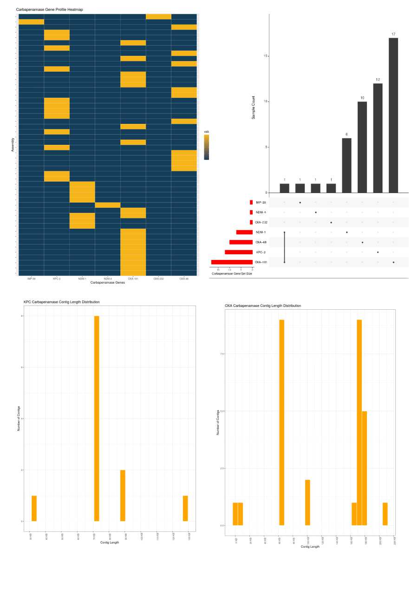

---
# Example from https://joss.readthedocs.io/en/latest/submitting.html
title: 'CPgeneProfiler: A lightweight R package to profile the Carbapenamase genes
  from genome assemblies'
tags:
  - R
  - Carbapenamase gene profile
  - cocarriage
  - Beta-lactamases
  - Antimicrobial resistance (AMR)
authors:
  - name: Prakki Sai Rama Sridatta
    orcid: 0000-0002-9254-2557
    affiliation: "1,2" 
  - name: Natascha M Thevasagayam
    affiliation: "1,2"
  - name: Weizhen Xu
    affiliation: "1,2"
  - name: Kalisvar Marimuthu
    affiliation: "1,2"    
  - name: Jeanette W P Teo
    affiliation: 3   
  - name: Indumathi Venkatachalam 
    affiliation: 4
  - name: Ng Oon Tek
    affiliation: "1,2,5"                      
affiliations:
 - name: National Centre for Infectious Diseases, Singapore
   index: 1
 - name: Tan Tock Seng Hospital, Singapore
   index: 2
 - name: National University Hospital, Singapore
   index: 3
 - name: Singapore General Hospital, Singapore
   index: 4      
 - name: Lee Kong Chian School of Medicine, Nanyang Technological University, Singapore
   index: 5       
date: 10 July 2020   
bibliography: paper.bib
---

# Summary

“Carbapenems” are a specific subset of antibiotics considered to possess a higher spectrum of antimicrobial activity [@papp2011carbapenems] against Gram-positive and Gram-negative bacteria. Even so, there are pathogens which are resistant to carbapenems due to the presence of carbapenamase genes (CP genes) which have the ability to hydrolyze carbapenems. 

Studies show that those cases infected by carbapenem-resistant pathogens have a higher morbidity and mortality rate compared with those who are infected by non carbapenem-resistant pathogens [@van2013carbapenem; @cai2017prevalence]. Therefore, early discerning of the CP genes and their resistance mechanisms are considered crucial to aid in infection control as well as lessen the likelihood of mortality, duration of hospitalization stay, and related medical costs [@van2013carbapenem; @nordmann2019epidemiology]. Further, it is understood that the co-carriage of genes encoding different classes of carbapenemases could confer higher resistance to carbapenem antibiotics, which may promote further spread of the disease [@wang2019cocarriage].

The detection of the resistance genes from various bacterial strains using techniques such as polymerase chain reaction (PCR) and microarrays in real time are very time consuming and costly. With the advancement in whole-genome sequencing (WGS) technologies the costs are more accessible and WGS provides an alternative method for detection of resistance genes, given that the relevant analysis tools are available.

To this end, several freely available bioinformatics resources were identified to find the antimicrobial resistance genes in nucleotide as well as amino acid sequence data [@hendriksen2019using]. Some of these resources include, but not limited to are ``ARIBA`` [@hunt2017ariba], ``ARG-ANNOT`` [@gupta2014arg], ``CARD database`` [@jia2016card], ``MEGARes`` [@lakin2017megares], ``NCBI-AMRFinder`` (https://www.ncbi.nlm.nih.gov/pathogens/antimicrobial-resistance/AMRFinder/), ``KmerResistance`` (https://cge.cbs.dtu.dk/services/KmerResistance/), ``SRST2`` [@inouye2014srst2] and ``ResFinder`` [@zankari2012identification].

Current antimicrobial resistance gene finding tools can detect the genes from either genome assemblies or sequencing reads but do not exclusively report a genetic profile for the presence of CP genes across all the genome assemblies and neither provide the ability to extract and visualize the co-carriage of multiple CP genes. Therefore, to address this need, we describe here a lightweight R package, **CPgeneProfiler** that scans bacterial genome sequences to detect the presence of CP genes using R framework. 



In addition to profiling the CP genes and finding co-carriage of CP genes in genome assemblies (Figure 1a), the tool also generates plots which visualizes set intersections of CP genes across all the input genome assemblies (Figure 1b). Lastly, ``CPgeneProfiler`` also generates simple N50 & N90 statistic plots and CP gene-containing contig length distributions summary plots (Figure 1c, 1d). Currently, ``CPgeneProfiler`` can be executed under the Linux/Unix operating system.

# CPgeneProfiler R Package

The R package ``CPgeneProfiler``, currently in version 2.1.0 on Github (https://github.com/ramadatta/CPgeneProfiler), checks for the presence of CP genes in a list of genome assemblies provided in fasta file format. A wiki page with more detailed instructions on how to install the package on a system can be accessed at: https://github.com/ramadatta/CPgeneProfiler/wiki/Step-by-Step-Guide

## Step 1: Download CP gene database using R

```r
# Specify CP gene database URL 
> url <- "https://raw.githubusercontent.com/ramadatta/CPgene-profiler
/master/ARG-annot_CPGene_DB.fasta"

# Specify destination where CP gene database file should be saved 
> path <- "/home/user/db" # Can change to prefarable location
> setwd(path)
> destfile <- "ARG-annot_CPGene_DB.fasta"

# Download the CP gene database file to the folder set in "path"
> download.file(url, destfile)
```
## Step 2: Install CPgeneProfiler package

The R package ``CPgeneProfiler`` can be installed by typing the following in R:

```r
devtools::install_github("ramadatta/CPgeneProfiler")
```
  After installation, the package can be used as follows:

```r
> CPgeneProfiler("/path/Multiple_FastaFiles_Location/","/home/user/db/")
```

# Acknowledgement
The authors would like to thank Victor Ong and Wang Liang De for generating the sequence data that was used for developing and testing the tool. 

# Funding
This work is supported by the Singapore Ministry of Health’s National Medical Research Council under its NMRC Collaborative Grant: Collaborative Solutions Targeting Antimicrobial Resistance Threats in Health Systems (CoSTAR-HS) (NMRC CGAug16C005) and NMRC Clinician Scientist Award (MOH-000276).  Any opinions, findings and conclusions or recommendations expressed in this material are those of the author(s) and do not reflect the views of MOH/NMRC.


# References  
